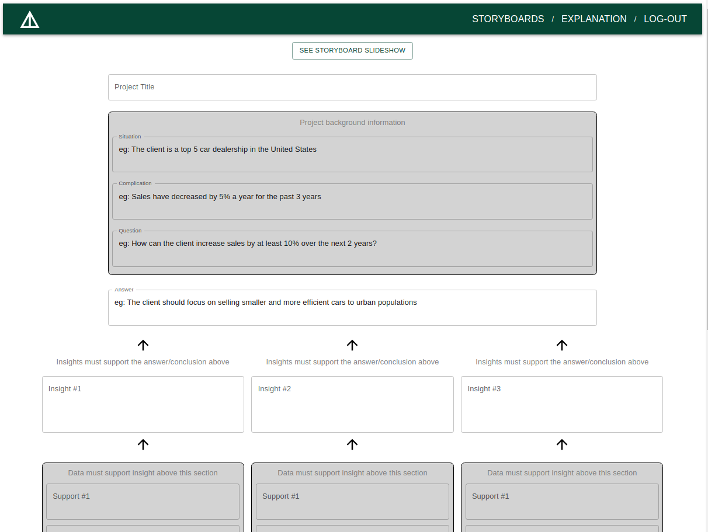

# PYRAMID APP

Simple web application that gives users a framework to structure their arguments and insights and creates a simple storyboard so the user can check how their presentation flows



## Table of Contents
* [Key Features](#key-features)
* [Technologies](#technologies)
* [Getting Started](#getting-started)
* [Design Documentation](#design-documentation)
* [Challenges](#challenges)

## Key Features
* Passwordless login using magic SDK
* Autosave progress as the user creates storyboards
* Unlimited number of storyboards per user
* Simple slideshow feature that lets users review how the storyboard might look as a presentation
* Responsive design
* Explanation of pyramid principle writing framework

## Technologies
This project was created with:
* [React.js](https://reactjs.org/)
* [Ruby on Rails](https://rubyonrails.org/)
* [Material UI](https://mui.com/)

## Getting Started
To clone and run this application, you'll need the following:
* [Git](https://git-scm.com/) 
* [npm](https://www.npmjs.com/) or [yarn](https://yarnpkg.com/)
* [Ruby](https://www.ruby-lang.org/en/) version '>= 3.0'
* [Ruby on Rails](https://rubyonrails.org/) version '>= 6.1.4.1'

```bash
# Clone this repository
$ git clone https://github.com/felipeberger/pyramid-app

# Go into the repository
$ cd pyramid-app

# Make sure you have the correct ruby and rails versions installed
$ ruby -v
$ rails -v

# Install dependencies
$ npm install or $ yarn 
$ bundle

# Run the app on a local server
$ rails s 
navigate to http://localhost:3000/
```
## Design Documentation
The project started by identifying a target market and a reason to exist for the web app
```
The website will let users outline their arguments and research following the Pyramid Principle, a classic consulting framework. The pyramid principle forces users to think logically about their arguments and supporting information through constraints in how the information flows along the pyramid structure. This constraint is very helpful for entry level analysts and non-native English speakers as it does not require them to write long paragraphs, but to focus on impactful insights and supporting research and graphs/charts.
```

Then a wireframe on figma visualized what the app could look like


## Challenges
There were several challenges faced during the creation of this app. The major challenges were:
* Implementation of the magic SDK in local environment - the environmental variables were not available for the SDK. The solution involved installed dotenv to make the variables available 
* Implementation of magic SDK in production environment (Heroku) - the environmental variables were also not available to the SDK in production as dotenv required a .env.production document pointed as the .env file
* Being flexible with the implementation of the initial wireframes and product ideas - The initial idea for the app was more ambitious than the v1.0, but the end result was a narrowly focused app that does not attemp to do much outside of its reason to exist, which is to let consultants structure arguments and insights

